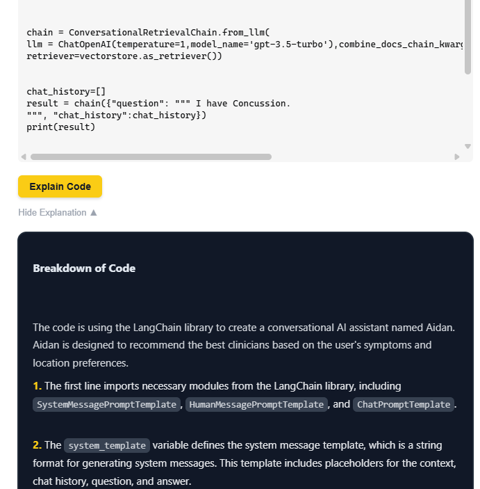

# Code Explainer AI – Chrome Extension

A lightweight, AI-powered Chrome extension that explains code snippets on any webpage using LLaMA 3 via Groq and LangChain.

Simply click **"Explain Code"** next to any `<pre><code>` block, and get a structured breakdown with contextual memory and summaries — all powered by FastAPI and LangChain.

---

## Features

-  **Inline Explanations** – Injects an "Explain Code" button next to code blocks on supported pages.
-  **Memory-Aware** – Remembers previous explanations per tab to provide contextual understanding.
-  **Powered by LLaMA 3 via Groq** – Fast, intelligent breakdowns using Groq-hosted open models.
-  **FastAPI Backend** – Connects your extension with Groq’s API using LangChain’s structured prompt pipeline.
-  **Clean UI** – Stylish, collapsible explanation cards.
-  **Works On** – Stack Overflow, GitHub, and most modern developer documentation sites.

---

## Built With

- [LangChain](https://www.langchain.com/) – for prompt structuring, memory, and model orchestration  
- [Groq API](https://console.groq.com/) – to run open LLMs like LLaMA 3 at blazing speed  
- [FastAPI](https://fastapi.tiangolo.com/) – to serve and handle requests  
- [Chrome Extensions API](https://developer.chrome.com/docs/extensions/) – for dynamic injection, message passing, and tab tracking 

---

## Example Usage

